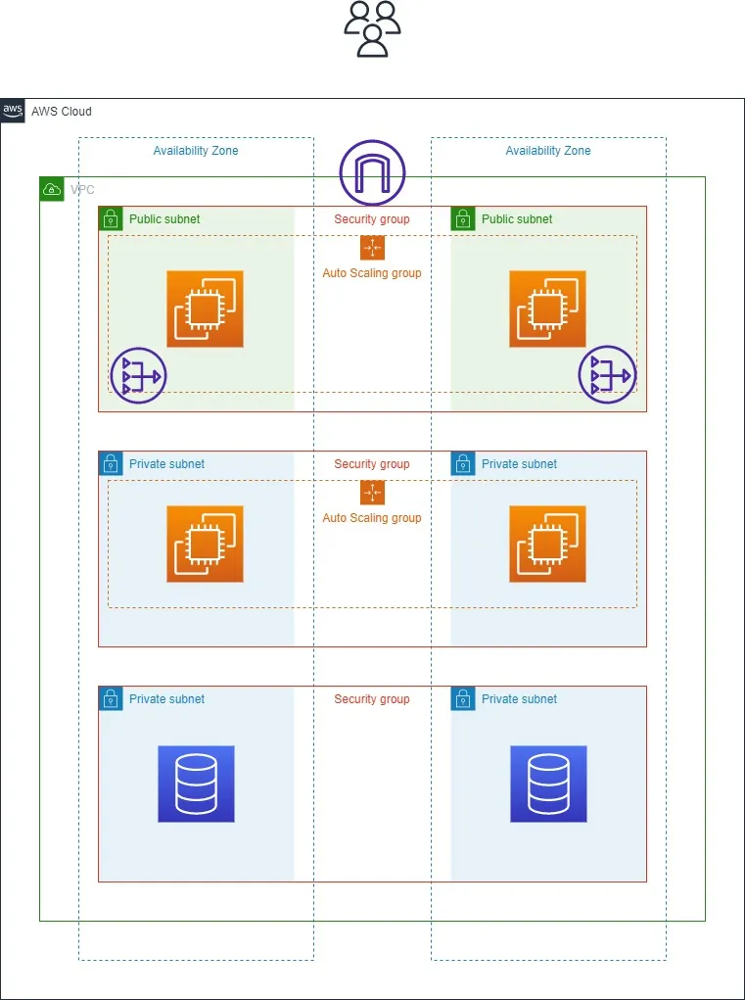
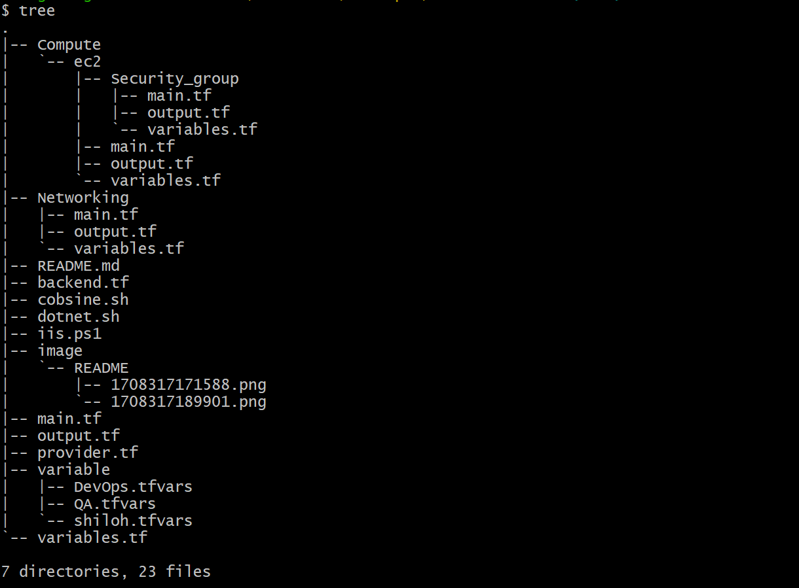
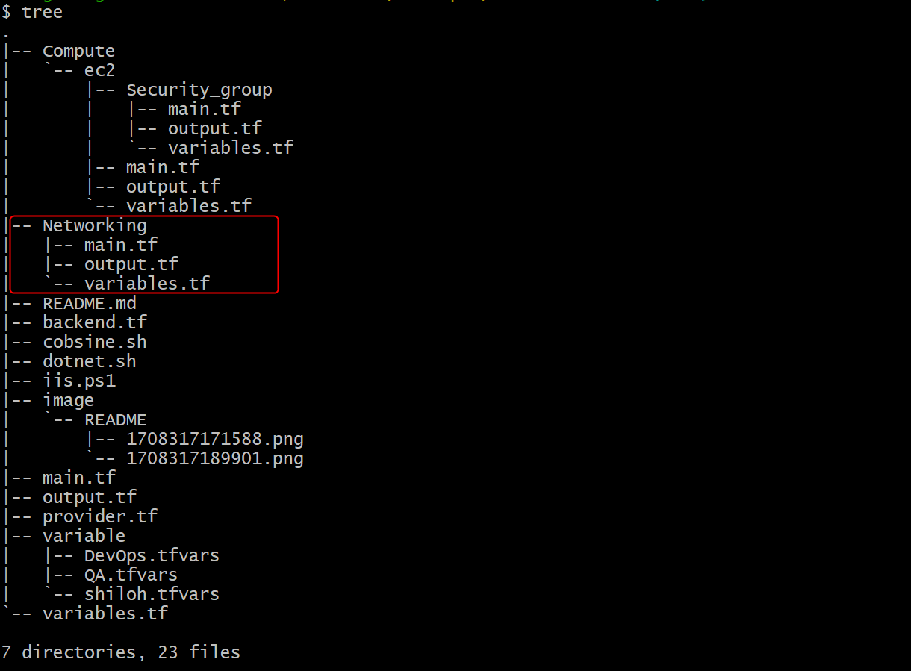
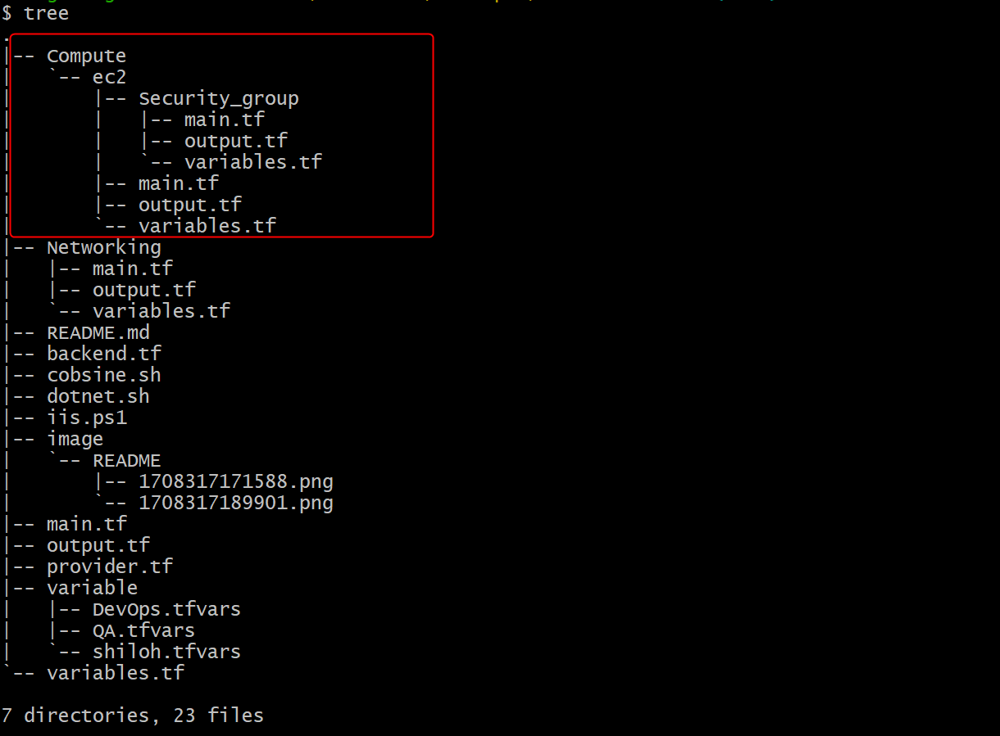
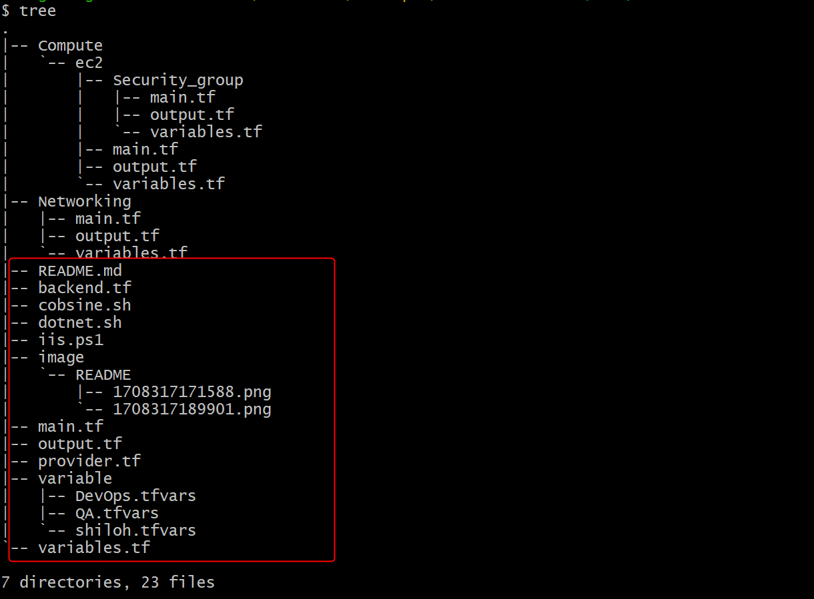

## Creating a 3 tier architecture with terraform

The following terraform code creates a 3 tier architecture on your environment. The following resources will be built:

1. A vpc
2. 2 private subnets
3. 2 public subnets
4. An internet gateway
5. A NAT gateway
6. an elastic IP
7. 2 app servers
8. 2 web servers
9. 2 DB servers
10. an application load balancer (ALB)
11. Route 53 A record mapped to the ALB

*WARNING: Some of these resources will acrrue charges so make sure to run a terraform destroy upon finishing the project.*



## Prerequisites for completing the process

* An AWS account (Please refer to [this](https://docs.aws.amazon.com/accounts/latest/reference/manage-acct-creating.html) documentation on how to create an aws account)
* knowledge on aws networking (vpc, subnets etc.). For more information on networking please refer to [this documentation](https://aws.amazon.com/products/networking/)
* knowledge on aws compute resources (ec2, security groups etc). For more information on aws compute please refer to [this documentation](https://docs.aws.amazon.com/whitepapers/latest/aws-overview/compute-services.html)
* knowledge on terraform as an IAC (For more information please refer to [this video](https://www.youtube.com/watch?v=7xngnjfIlK4)

## Deploying the resources

This terraform code is made up of 3 modules. A *network module* (vpc, subnets etc), a *security group* module and an *instance module* (creates all the instances). The module are all created in the order listed as each one is depended on the other. 



#### Network module:

* This module creates all the network resources
* The resources created are a vpc, 2 public subnets, 2 private subnets, an internet gateway, a nat gateway, an elastic ip associated to the nat gateway
* To launch the resources in this module you will need to create a provider.tf file in the specified directory and provide the values for all the variables in the variable.tf file
* The variables can be added directly in the variable.tf file or in a tfvars file
* 

#### Compute modules:

This is made up of the security group and instance module. The security group module creates all the security groups required for the instances and the instance module creates all the instances, load balancer and route 53 record. 

##### Security group module:

* As mentioned above this creates all the security groups required for the servers
* The resources created are:
* > ssh bastion security group
  >
* > rdp bastion security group
  >
* > app server security group
  >
* > web server security group
  >
* > database server security group
  >
* > Load balancer security group
  >
* 

##### Instance module:

This creates all the instances and more. The resources created on this module are:

* > An app server located in the private subnet
  >
* > A web server located in the pulic subnet
  >
* > A database server located in the private subnet
  >
* > An ssh bastion
  >
* > An rdp baston
  >
* > An application load balancer
  >
* > 2 target groups
  >
* > A route 53 record for the load balancer
  >

  As with the network module to create the resources on this module a provider file needs to be created in this directory. Unlike the network module this module is dependent on the network module so that module needs to be created before this one. 

##### Running the terraform code:



The main.tf file in the root directory contains all the above modules. Complete the following steps before running the below terraform commands:

* create a tfvars file and add all the required values for all your environments as seen above (Devops.tfvars, QA.tfvars)
* create an s3 bucket in your environment and a dynamo DB table in your environment and provide all the neccessary values in the backend.tf file. For more info on backend.tf refer to [this video](https://www.youtube.com/watch?v=o04xfWEouKM)
* Create workspaces for resource deployment in multiple environments. For more information on terraform workspaces refer to [this documentation](https://spacelift.io/blog/terraform-workspaces)
* Once complete you can now run the below terraform commands:
* ```
  terraform init
  ```
* ```
  terraform plan -var-file=variable/"tfvars file here"
  ```
* ```
  terraform apply -var-file=variable/"tfvars file here"
  ```
* The above tfvars file can be named anything as long as it ends with .tfvars extension. This file is not read by terraform hence the reason why the path is provided in the above command
